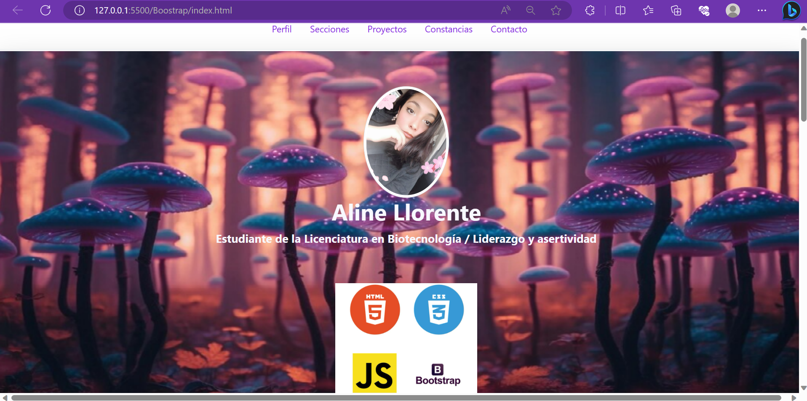
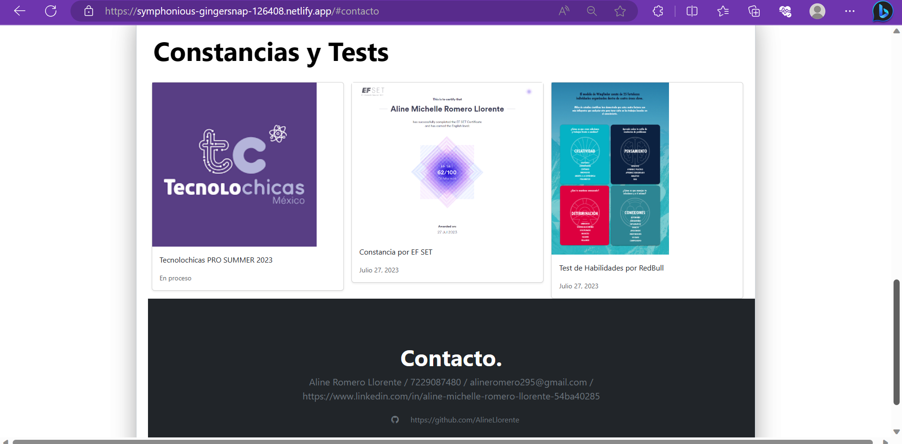

# Portafolio Responsivo con Bootstrap 5 

El presente proyecto es creado para el bootcamp de **Tecnolochicas PRO Summer Camp**

Es una página web responsiva *(adaptable a diversos tamaños de pantalla)*.

El propósito del sitio web es mostrar el portafolio de proyectos de un(a) desarrollar(a) y su experiencia

Incluye uma descripción de su motivación, experiencia, proyectos, artículos publicitarios y formas de contacto.

También contiene una sección de almacenamiento de archivos *(imágenes)* que nos permiten modificar la imagen de perfil del desarrollador.

## Demo

Puedes entrar a ver el demo en este vínculo: 
https://symphonious-gingersnap-126408.netlify.app/

La idea es inspirarte con esta demostración de proyecto. 

No te desesperes si no lo logras a la primera, reuerda que todo lleva esfuerzo y mucho tiempo. 
No dudes en escribirnos si tienes alguna duda o sugerencia. 

## Tecnologías

Esta página fue creada con:

* HTML 5
* CSS 3
* Javascript
* Bootstrap

Además se incluyen *Google Fonts*

## Idioma
El texto e la página web escrito en español, sin embargo las clases relacionadas con Bootstrap se incluyen en inglés.

## Contacto

Desarrollado en: Tecnolochicas PRO Summer Camp 2023

Aline Romero Llorente.

## Agradecimientos

Quiero agradecer a las mentoras del bootcamp TECNOLOCHICAS PRO summer 2023 ya que nos ayudaron de la mejor manera en todas las dudas y problemas que surgieron durante las sesiones. 